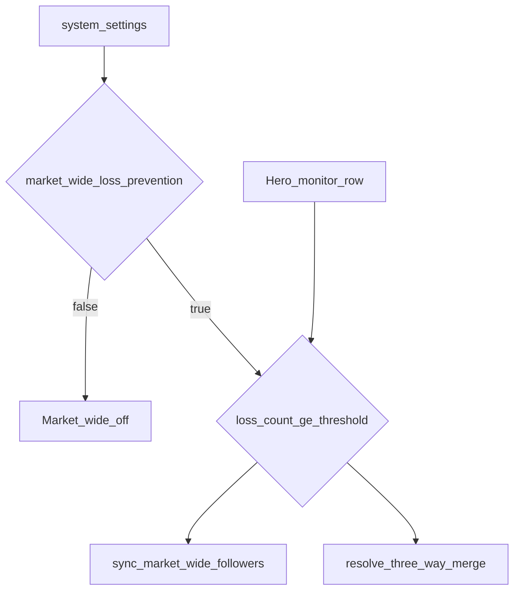

**Status:** done (completed 2026-05-12)

# Market-wide loss prevention (hero monitor + threshold + master toggle + UI)

## Current architecture (baseline)

- **Symbol-wide LP** today: hero monitors (per `live_data.live_symbol_status.monitor_follow` name match) push LP fields into `live_symbol_status` for their **symbol**; followers with `symbol_wide_loss_prevention` merge via [`more_serious_loss_prevention_state`](backend/core/symbol_wide_loss_prevention.py) in [`resolve_effective_loss_prevention_state`](backend/core/symbol_wide_loss_prevention.py) and in [`get_monitors_api_payload`](backend/core/monitor_list_api.py) (JOIN `live_symbol_status` on symbol only).
- **Recompute hook**: [`recompute_monitor_loss_prevention`](backend/core/time_based_loss_prevention.py) updates the row, then calls [`sync_symbol_wide_loss_prevention_from_monitor`](backend/core/symbol_wide_loss_prevention.py) (user `0001` only today) or [`project_symbol_wide_loss_prevention_to_monitor`](backend/core/symbol_wide_loss_prevention.py).
- **Sizing**: [`normalize_loss_prevention_state_for_sizing`](backend/core/symbol_wide_loss_prevention.py) + explicit tuples in [`auto_entry_supervisor.py`](backend/auto_entry_supervisor.py) (~2657) and [`active_trade_supervisor.py`](backend/active_trade_supervisor.py) (~4886) treat `live_loss_1c` as full 1-contract live sizing.

**Trigger rule (confirmed):** when master toggle is on and `COALESCE(hero.loss_prevention_cooldown_loss_count, 0) >= stop_loss_count_threshold`, regardless of whether the hero is in simulated tier cooldown or live time-based cooldown (same `loss_prevention_cooldown_loss_count` column).

## Design decisions

1. **New LP token:** `live_loss_market_wide_1c` (base). For followers, reuse [`symbol_wide_loss_prevention_state`](backend/core/symbol_wide_loss_prevention.py) so persisted/effective string is **`live_loss_market_wide_1c_symbol_wide`** (same `_symbol_wide` attribution as today).

2. **Master enable:** Column **`market_wide_loss_prevention`** on `users.system_settings_*`: `BOOLEAN NOT NULL DEFAULT TRUE`. When **false**, market-wide state is always treated as off (no merge, no follower sync updates for market-wide), regardless of hero id / threshold / loss count.

3. **Precedence:** For monitors with `symbol_wide_loss_prevention` + LP toggle on:  
   `effective = more_serious( more_serious(local, lss_symbol_state), market_wide_state )`  
   where `market_wide_state` is off unless master toggle is true and threshold condition holds on the configured hero.

4. **Severity / sizing:** Extend [`_SIZING_STATES`](backend/core/symbol_wide_loss_prevention.py), [`_STATE_SEVERITY`](backend/core/symbol_wide_loss_prevention.py), and [`_sql_loss_prevention_severity_expr`](backend/core/symbol_wide_loss_prevention.py) so `live_loss_market_wide_1c` is severity **4** (same tier as `live_loss_1c`).

5. **Persistence:** Mirror symbol-wide: `sync_market_wide_loss_prevention_followers` bulk-UPDATES qualifying `monitor_list_*` rows after hero LP recompute when the hero id matches settings; clear branch when market-wide turns off (count below threshold, toggle off, or invalid hero).

6. **Slot / tenant:** Prefer deriving user slot from `monitor_list_qualified` and reading `users_<slot>.system_settings_<slot>` so behavior is not hard-coded to `0001` only unless you intentionally match existing symbol-wide hero sync restrictions.

## Schema and migrations

Reversible migration + [`database.py`](backend/core/config/database.py) greenfield / repair `DO` blocks:

| Column | Type | Default | Notes |
|--------|------|---------|--------|
| `market_wide_loss_prevention` | `BOOLEAN NOT NULL` | `TRUE` | Master feature toggle |
| `hero_monitor_id` | `INTEGER NULL` | `NULL` | FK to `users.monitor_list_<slot>.id` (document; optional DB FK) |
| `stop_loss_count_threshold` | `INTEGER NULL` | `NULL` | e.g. `>= 1` when set; NULL = no threshold / treat as disabled for gate |

Update [`docs/MASTER_DB_SCHEMA_REFERENCE.md`](docs/MASTER_DB_SCHEMA_REFERENCE.md).

## Settings API and store

- [`fetch_system_settings_row`](backend/core/system_settings_store.py): extend SELECT + returned dict with `market_wide_loss_prevention`, `hero_monitor_id`, `stop_loss_count_threshold`.
- New or extended updater in [`system_settings_store.py`](backend/core/system_settings_store.py) for POST (validate monitor id exists for tenant, threshold integer when feature used, boolean always allowed).
- [`main_misc_routes.py`](backend/web/routers/main_misc_routes.py) GET/POST `/api/system_settings`: accept and return the new fields alongside existing drawdown fields.

Helper e.g. `fetch_market_wide_loss_prevention_config(cursor, user_number)` returns `(enabled_bool, hero_id, threshold)` for core LP code.

## Core LP logic

**File:** [`backend/core/symbol_wide_loss_prevention.py`](backend/core/symbol_wide_loss_prevention.py)

- `compute_market_wide_loss_prevention_state(...)`: if `market_wide_loss_prevention` is false → `"off"`. Else load hero by `hero_monitor_id`, require `loss_prevention_toggle`, compare `loss_prevention_cooldown_loss_count` to `stop_loss_count_threshold` (both must be configured meaningfully for “on”).
- `resolve_effective_loss_prevention_state`: three-way merge as above.
- `sync_market_wide_loss_prevention_followers`: same pattern as symbol-wide bulk UPDATE; invoke from [`recompute_monitor_loss_prevention`](backend/core/time_based_loss_prevention.py) when updated monitor is the configured hero.

## API monitor list

**File:** [`backend/core/monitor_list_api.py`](backend/core/monitor_list_api.py) — second `more_serious` pass with market-wide state; extend `effective_live_loss_prevention_cooldown_live` (or equivalent) for `live_loss_market_wide_1c` like `live_loss_1c` for UI badges.

## Other sizing call sites

[`auto_entry_supervisor.py`](backend/auto_entry_supervisor.py), [`active_trade_supervisor.py`](backend/active_trade_supervisor.py), and any other exhaustive LP tuples — add `live_loss_market_wide_1c`.

## Startup / restart reconcile (alongside existing LP backtest)

**Existing behavior:** On `trade_manager` process start, [`_tm_startup_sim_trade_lp_reconcile`](backend/trade_manager.py) runs inside the FastAPI [`lifespan`](backend/trade_manager.py) handler. It calls [`startup_reconcile_simulated_trade_for_tenant`](backend/core/time_based_loss_prevention.py), which (under a per-tenant advisory lock) replays simulated-trade LP for all time-method monitors, then runs [`recompute_monitor_loss_prevention`](backend/core/time_based_loss_prevention.py) for [`configured_symbol_wide_monitor_ids`](backend/core/symbol_wide_loss_prevention.py) not already replayed. That is the current “LP backtest on restart” for sim ledger + symbol-wide heroes.

**Add:** Run market-wide startup reconcile **in the same tenant DB session** as the existing startup reconcile. Prefer extending [`startup_reconcile_simulated_trade_for_tenant`](backend/core/time_based_loss_prevention.py) so the new steps execute **before** [`pg_advisory_unlock`](backend/core/time_based_loss_prevention.py) in the `finally` block (avoid acquiring `pg_advisory_lock` twice on the same key in one session, which can self-deadlock). Alternatively, invoke a helper from [`_tm_startup_sim_trade_lp_reconcile`](backend/trade_manager.py) on a **second** connection only if the lock scope is refactored; the default recommendation is one lock scope for “full LP startup reconcile.”

Implement a new function e.g. **`startup_reconcile_market_wide_loss_prevention_for_tenant(cursor, monitor_list_qualified, tenant_slot)`** in [`time_based_loss_prevention.py`](backend/core/time_based_loss_prevention.py) or [`symbol_wide_loss_prevention.py`](backend/core/symbol_wide_loss_prevention.py), called at the end of the existing startup reconcile `try` body:

1. If `market_wide_loss_prevention` is false or hero/threshold not configured, no-op (optional debug log).
2. **`recompute_monitor_loss_prevention`** once for **`hero_monitor_id`** so hero `loss_prevention_cooldown_loss_count` and `loss_prevention_state` match the same post-replay ground truth as the rest of the fleet (hero may not be in `configured_symbol_wide_monitor_ids` if it is not an LSS symbol-follow hero).
3. Call **`sync_market_wide_loss_prevention_followers`** so every monitor with `symbol_wide_loss_prevention` + LP toggle has persisted `loss_prevention_state` aligned with the three-way effective rule (including `live_loss_market_wide_1c_symbol_wide` when the gate fires, or cleared when it should not).
4. Log a single structured line on success/failure (mirror `[SIM TRADE LP]` style, e.g. `[MARKET WIDE LP] startup reconcile completed`) for ops visibility after MASTER_RESTART.

**Tests:** Add a unit test that mocks cursor/tenant and asserts the startup helper invokes hero `recompute` then `sync_market_wide` when settings are enabled and threshold is met; assert no-op when master toggle is false. Optionally extend [`tests/unit/test_loss_prevention_new.py`](tests/unit/test_loss_prevention_new.py) if it already patches startup reconcile.

## Dashboard UI — system settings popover

**Desktop:** [`frontend/tabs/dashboard.html`](frontend/tabs/dashboard.html)

- Markup inside [`#systemSettingsPopoverPanel`](frontend/tabs/dashboard.html) (after drawdown block, before modal actions): a labeled section **“Market-wide loss prevention”** with:
  1. **Checkbox** — `id="systemSettingsMarketWideLpEnabled"` bound to `market_wide_loss_prevention` (checked when true; default true from API).
  2. **Dropdown** — `id="systemSettingsMarketWideHeroMonitor"`; options = active monitors (non-archived), **value = numeric monitor `id`**, display = sensible label (e.g. `name` + `symbol`). Include empty option “— None —” when hero not set.
  3. **Number input** — `id="systemSettingsMarketWideThreshold"` for `stop_loss_count_threshold` (min 1 when saving with feature intent; allow empty for NULL).

- **Load:** extend [`loadSystemSettingsIntoForm`](frontend/tabs/dashboard.html) to set the three controls from GET `/api/system_settings`. Populate dropdown: either call existing [`loadMonitors`](frontend/tabs/dashboard.html) / in-memory monitor list if reliably available when popover opens, or `fetch('/api/monitors')` once when opening the popover (same-origin), then fill `<select>` and set selected `hero_monitor_id`.

- **Save:** extend [`saveSystemSettingsPopover`](frontend/tabs/dashboard.html) POST body with `market_wide_loss_prevention`, `hero_monitor_id` (null if empty), `stop_loss_count_threshold` (null if empty). Client validation: if enabled and threshold set, require hero id (or document relaxed server rules).

- **UX:** Disable or dim hero + threshold inputs when master checkbox is unchecked (optional but recommended).

**Mobile:** mirror the same behavior in [`frontend/mobile/dashboard_mobile.html`](frontend/mobile/dashboard_mobile.html) (grep `systemSettingsPopoverRoot`, `loadSystemSettingsIntoForm`, `saveSystemSettingsPopover`).

## LP display labels

[`frontend/tabs/dashboard.html`](frontend/tabs/dashboard.html) and [`frontend/mobile/dashboard_mobile.html`](frontend/mobile/dashboard_mobile.html) — map `live_loss_market_wide_1c` to a short label (e.g. “Market-wide 1c”) next to `live_loss_1c`.

## Tests

[`tests/unit/test_symbol_wide_loss_prevention.py`](tests/unit/test_symbol_wide_loss_prevention.py): severity, merge order, `market_wide_loss_prevention = false` forces off, sync/clear paths. API/store tests if the repo has patterns for `main_misc_routes`.

## Operational notes

- Defaults: feature **on** at DB level (`market_wide_loss_prevention = true`) but gate still inactive until `hero_monitor_id` and `stop_loss_count_threshold` are set.
- Deploy: migration before code; restart workers after deploy.

