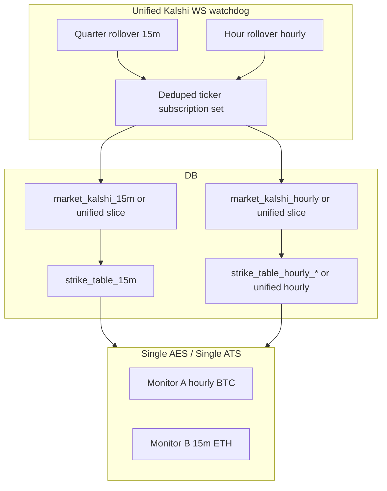

# Unified Kalshi WS market watchdog + master AES/ATS

**Status:** draft

**Related:** [unified-15m-aes-ats-reads.md](unified-15m-aes-ats-reads.md) (15m data plane / supervisors today; this plan extends to hourly and a single watchdog).

## Design principle (your “perfect world”)

**Prefer one market watchdog, not `*_hourly` vs `*_15m` scripts**, unless profiling or Kalshi limits force a split later. A sound design:

- **One process** maintains **one (or few) WS connections** and a **single global subscription set**: `dedupe(all_market_tickers_needed_for_15m ∪ all_market_tickers_needed_for_hourly)`.
- **Rollover logic branches inside that process:**
  - **Quarter-hour:** existing 15m contract (clear unified 15m table slice, REST discovery where required, resubscribe delta).
  - **Top of hour:** hourly event resolve + ladder tickers + resubscribe delta (no `floor_strike` gate like 15m unless API gaps force it).
- **REST stays bounded:** two schedules, shared rate-limit discipline ([backend/market_watchdog.py](backend/market_watchdog.py) / shared HTTP helpers).

No architectural requirement to keep `market_watchdog_ws.py` vs a separate hourly file forever—**merge into one module** with clear internal subroutines so you do not duplicate WS auth, reconnect, generation counters, or subscribe batching.

## AES / ATS — one router, scan “alongside” hourly and 15m

**One AES process and one ATS process** should iterate **all active monitors** (same idea as [backend/core/unified_15m_monitors.py](backend/core/unified_15m_monitors.py) today, but extended to hourly).

For **each monitor iteration**, the code must establish an explicit **binding context** (thread-local or async context, same pattern as existing `ctx_mid()` / `ctx_user()` in [backend/auto_entry_supervisor.py](backend/auto_entry_supervisor.py) / [backend/active_trade_supervisor.py](backend/active_trade_supervisor.py)):

- `monitor_id` (DB primary key)
- `user_number`
- `market` ∈ `{hourly, 15m}`
- `symbol` from that monitor’s `monitor_list` row

Then:

- **Strike data:** load only from the **strike table path that matches `market` + `symbol`** (hourly table vs unified `strike_table_15m`), never parameterized by another monitor’s market.
- **Settings:** load **only** from that monitor’s row (`min_probability`, gates, `paper_trade`, etc.).
- **Trades:** `monitor` string on payloads must resolve to **that same** `monitor_list` id ([backend/trade_manager.py](backend/trade_manager.py) validation already encodes “no ghost monitors”—extend mentally to “no wrong market strike read”).

Visually, **streams do not cross** because there is **no shared mutable “current monitor”** across concurrent tasks without binding; iteration should be **sequential per monitor** or **strictly isolated tasks** if you parallelize later.

## Non-negotiable invariants (“never cross streams”)

| Invariant | Enforcement |
|-----------|-------------|
| Settings | Always `SELECT ... FROM monitor_list WHERE id = ctx_mid()` inside bound context |
| Strike source | Function `strike_source_for(market, symbol)` returns table name or query fragment; **no** monitor-level cache keyed only by symbol |
| Trade insert | `monitor` / `mon_{user}_{id}` matches bound `id`; keep trade_manager rejection on unknown monitor |
| Concurrency | If parallel monitor loops: one **binding stack** per task; no globals for “current symbol” |
| Audit | Optional debug log line on entry evaluation: `monitor_id`, `market`, `symbol`, `strike_table`, `event_ticker` from header row |

**Tests to add:** table-driven cases: two monitors same symbol different markets; two monitors different symbols; ensure AES never reads 15m table for an hourly monitor and vice versa (mock DB or integration with temp rows).

## Phased delivery (implementation order, not duplicate scripts forever)

Incremental rollout reduces blast radius; **end state** is still **one watchdog + one AES + one ATS**.

1. **Unified market schema** — hourly canonical table(s) aligned with 15m patterns; migrations + docs.
2. **Unified WS watchdog** — merge 15m WS path with hourly ladder subscribe + hour rollover; retire `kalshi_market_watchdog_hourly_*` REST loops from [scripts/config/generate_unified_supervisor_config.py](scripts/config/generate_unified_supervisor_config.py).
3. **Strike generators** — read unified feeds; keep correctness parity with current hourly/15m outputs.
4. **Master AES/ATS** — collapse per-monitor hourly processes into one router; keep or merge with existing `unified_15m` so you end with **one** AES and **one** ATS total (or document why two binaries if you split only for crash isolation).
5. **Health + observability** — WS connectivity–first health; subscribe/instrumentation; quiet-market thresholds.
6. **Deploy** — changelog checklist, staged prod enable.

## Risks (updated)

| Risk | Mitigation |
|------|------------|
| **Cross-stream bugs** | Binding discipline + tests + trade_manager monitor validation |
| Single watchdog blast radius | Strong health gates; supervisor restart single program; snapshot before cutover |
| Subscribe size / Kalshi limits | Dedupe; incremental delta on rollover; monitor Kalshi errors |
| One AES bug affects all monitors | Staged rollout; canary monitor; logging invariants |

## Opinion

Unifying **watchdog + AES/ATS** is coherent and matches how you already unified 15m. The caution you named is exactly the right one: **correctness is 100% about binding monitor → settings + monitor → strike source**. The rest is engineering ergonomics and subscription sizing.
