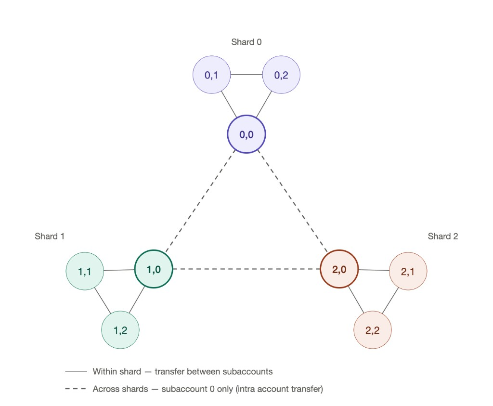

# Kalshi exchange sharding

Canonical reference for Kalshi matching-engine shards and how REC.IO addresses balances and orders. Official Kalshi docs: [Exchange Sharding](https://docs.kalshi.com/getting_started/exchange_sharding), [Create Subaccount](https://docs.kalshi.com/api-reference/portfolio/create-subaccount), [Intra Account Transfer](https://docs.kalshi.com/api-reference/portfolio/intra-account-transfer), [Transfer Between Subaccounts](https://docs.kalshi.com/api-reference/portfolio/transfer-between-subaccounts), [Create Order V2](https://docs.kalshi.com/api-reference/orders/create-order-v2), [Get All Subaccount Balances](https://docs.kalshi.com/api-reference/portfolio/get-all-subaccount-balances).

## Why this exists

Kalshi splits trading across multiple matching engines (**exchange indexes / shards**). Collateral checks run **inside** each shard. Cash on shard 0 cannot collateralize an order on shard 2. Balances are reported as **`(exchange_index, subaccount_number)`** pairs.

## Shard map (first rollout)

| Shard (`exchange_index`) | Category | REC.IO relevance |
|--------------------------|----------|------------------|
| **0** | Catch-all (everything not listed below) | Legacy home of crypto before cutover; CASH / IAT hop still uses primary on 0 when moving across shards |
| **1** | Exotics (combos) | Not required for current product; probed in prep tests only |
| **2** | **Crypto** | **All crypto markets live exclusively here** after cutover (e.g. `KXBTC15M`, other `KX*15M` / crypto series) |
| **3** | Sports (Tennis, Baseball tags) | Future / unused today |

Timeline (Kalshi / ops): shard **2 funding** expected live around **2026-08-20** (IAT smoke tests); crypto **new** events on shard 2 from **2026-08-24**. Live markets are **not** migrated mid-flight; only newly created crypto events land on 2.

**Current trading scope:** REC.IO trades **crypto only**. Operational home for Master Trading Bankroll (MTB) after cutover is **`(2, 1)`**. Keep the full matrix model so other shards can be added later without redesign.

## Address model: `(exchange_index, subaccount)`

Think of portfolio cash as a 2D matrix, not a flat subaccount list.

- **Solid edges:** within-shard `POST /portfolio/subaccounts/transfer` with `exchange_index` (any subaccounts on the same shard).
- **Dashed edges:** cross-shard **IAT** — one `POST /portfolio/intra_exchange_instance_transfer` with `source_exchange_shard` / `destination_exchange_shard` and `source_subaccount` / `destination_subaccount`. REC.IO does **not** orchestrate multi-hop via primaries. Kalshi may still run internal non-atomic steps; if a later step fails, residual can sit on a primary — poll the matrix until the destination address credits.
- Order `exchange_index: -1` auto-routes **orders** by market ticker; it does **not** move cash.

| Subaccount | Role (REC naming) |
|------------|-------------------|
| **0** | Primary / **CASH** on that shard |
| **1** | **Master Trading Bankroll (MTB)** on that shard — orders default to this via `trade_executor` |
| **2+** | Ancillary (`Reserve` / `undefined_N`, …) |

Examples:

- `(0, 1)` — MTB on shard 0 (pre-cutover crypto collateral)
- `(2, 1)` — MTB on shard 2 (**post-cutover crypto trading bankroll**)
- `(2, 0)` — CASH/primary on shard 2

`GET /portfolio/subaccounts/balances` returns one row per populated pair (`subaccount_number`, `exchange_index`, `balance`, `updated_ts`).  
`GET /portfolio/balance` includes `balance_breakdown[]` with per-`exchange_index` totals.

### Schema plan (least destructive)

**Do not** rename tables to `subaccount_balance_<slot>_<exchange>_<n>`. Keep one table / row family per Kalshi **subaccount number**.

Add fixed shard cash columns on **both**:

1. Live snapshot: `users` / `users_NNNN`.`subaccounts_*`
2. History: `users` / `users_NNNN`.`subaccount_balance_*_<n>`

| Column | Meaning |
|--------|---------|
| `exchange_0_balance` | Cash on shard 0 for this subaccount (cents) |
| `exchange_1_balance` | Cash on shard 1 |
| `exchange_2_balance` | Cash on shard 2 (crypto MTB home after cutover) |
| `exchange_3_balance` | Cash on shard 3 (optional but cheap; known Kalshi map) |
| `balance` | **Sum** of the `exchange_*_balance` columns (existing readers keep working) |

Poll from `GET /portfolio/subaccounts/balances` (matrix). Unprovisioned pairs → treat as 0 for that shard column. Historical pre-sharding rows: backfill `exchange_0_balance = balance`, other shard cols 0.

**Semantics:**

- **`balance` (sum)** — portfolio display, hero aggregates, charts  
- **`exchange_2_balance` on subaccount 1** — post-cutover MTB collateral / automatic rake source; rake uses `REC_MTB_HOME_EXCHANGE_INDEX=2` and within-shard `#1→#0` on that shard

Same migration should touch live `subaccounts_*` and history `subaccount_balance_*_*` together so rake and history do not diverge.

## Funding and transfers

### Within one shard

`POST /portfolio/subaccounts/transfer` with `exchange_index` set (default `0`):

- Move cash between subaccounts **on that shard only**
- Example: `(2, 0) → (2, 1)` with `exchange_index=2`

### Across shards (single IAT)

`POST /portfolio/intra_exchange_instance_transfer` ([IAT](https://docs.kalshi.com/api-reference/portfolio/intra-account-transfer)):

- One call moves `(source_exchange_shard, source_subaccount)` → `(destination_exchange_shard, destination_subaccount)`
- Required: `source` / `destination` = `event_contract`, `amount` in **centicents** ($1 = `10000`), plus shard fields; optional `source_subaccount` / `destination_subaccount` (default `0`)
- Processed **asynchronously**; poll balances until the **destination address** shows the credit
- Example cutover: `(0, 1) → (2, 1)` in a single IAT (ensure `(2, 1)` exists first)

REC helpers: `transfer_kalshi_address` / `apply_intra_exchange_instance_transfer` in `backend/bookkeeper/kalshi_subaccount_transfer.py`. Account Manager Initiate Transfer sends `from_exchange_index` / `to_exchange_index`.

### Provisioning a new shard

Kalshi order of operations ([sharding guide](https://docs.kalshi.com/getting_started/exchange_sharding)):

1. **IAT** funds onto the target shard (any allowed source address → destination on that shard; primary `(E, 0)` appears once the shard is funded)  
2. **`POST /portfolio/subaccounts`** with `exchange_index=E` → creates numbered subs **1, 2, …** on that shard (you do **not** create 0; create returns the next `subaccount_number`)  
3. Place trading cash on **`(E, 1)`** (MTB) via within-shard transfer or direct IAT into `(E, 1)`

Create without prior funding on that shard fails (e.g. `user_not_found` / server error).

### Crypto MTB cutover hop (canonical)

To move MTB from shard 0 to shard 2:

1. Ensure `(2, 1)` exists (`POST /portfolio/subaccounts` with `exchange_index=2` if needed)  
2. **Single IAT** `(0, 1) → (2, 1)` (`source_subaccount=1`, `destination_subaccount=1`, shards `0`→`2`)  
3. Set **`REC_MTB_HOME_EXCHANGE_INDEX=2`** so automatic rake runs `#1→#0` on shard 2

Reverse: single IAT `(2, 1) → (0, 0)` (or `(0, 1)`) as needed for CASH.

## Orders (`trade_executor`)

Create Order V2 (`POST /portfolio/events/orders`) includes:

- `subaccount` — default **1** (MTB)  
- `exchange_index` — default **`-1`** (auto-route by market ticker)

Auto-route picks the shard where that market lives. It does **not** move collateral. The debit still comes from **`(market’s shard, subaccount)`**. For crypto on shard 2, cash must already be on **`(2, 1)`**.

Kalshi notes automatic routing adds some latency vs pinning a known `exchange_index`.

## Market data (ingest / rollover)

**No change expected** to ticker construction, WS subscribe filters, or 15m rollover for sharding:

- Market ticker strings are unchanged (e.g. `KXBTC15M-26AUG131630-30`)
- `market_watchdog` locates BTC 15m by EST wall clock and subscribes with `market_tickers: […]` on `ticker` / `orderbook_delta`
- `exchange_index` on `GET /markets` / events is metadata; subscribe path does not require it today
- Production ingest uses prod `external-api` REST/WS (not demo)

After cutover, **new** crypto markets should report `exchange_index: 2`. Smoke-check that REST shows 2 and WS still delivers ticker/orderbook for the clock-built ticker. See [KALSHI_MARKET_INGEST.md](KALSHI_MARKET_INGEST.md).

## Verified prep notes (2026-08-13 / 2026-08-20)

| Check | Result |
|-------|--------|
| Prod `GET /portfolio/subaccounts/balances` | Rows are `(exchange_index, subaccount)` pairs |
| Demo: IAT $0.01 → shard 2, then create 1/2/3 | Matrix `(2,0)…(2,3)` visible |
| Prod: $1 three-hop `(0,1) → (0,0) → IAT → (1,0) → create → (1,1)` | Confirmed (legacy hop; superseded by single IAT with subaccount fields) |
| Prod: $1 single IAT path to `(2,1)` after create | Confirmed 2026-08-20 (`(0,1)→(0,0)→IAT→(2,0)→(2,1)` before API subaccount fields; use single IAT going forward) |
| Prod `balance_breakdown` includes exchange_index 2 | Present (may be `$0` until funded) |
| Current `KXBTC15M` clock ticker | Still `exchange_index: 0` until new crypto events land on shard 2 |

## Implementation status (REC.IO)

| Area | Status |
|------|--------|
| `trade_executor` order `exchange_index` default `-1` | Done |
| Balance poll / `subaccount_balance_*` + `subaccounts_*` shard columns | Migration **`20260813_1448_subaccount_exchange_balances`** + poller writes `exchange_0..3_balance` from matrix API |
| Address transfer: within-shard + single IAT (`transfer_kalshi_address`) | Done — `backend/bookkeeper/kalshi_subaccount_transfer.py` |
| Account Manager Initiate Transfer exchange selectors | Done (desktop + mobile) |
| Automatic rake home shard (`REC_MTB_HOME_EXCHANGE_INDEX`) | Done — supervisord injects from `providers.kalshi.mtb_home_exchange_index` (default **2** post-cutover) |
| Docs (this file) | Canonical reference |
| Multi-shard non-crypto trading | Future — use same matrix; pin or auto-route per product |

## Related docs

- [PORTFOLIO_ACCOUNT_SYNC.md](PORTFOLIO_ACCOUNT_SYNC.md) — balance sync and subaccount roles  
- [KALSHI_MARKET_INGEST.md](KALSHI_MARKET_INGEST.md) — WS ingest and rollover  
- [ARCHITECTURE.md](ARCHITECTURE.md) — system overview  
