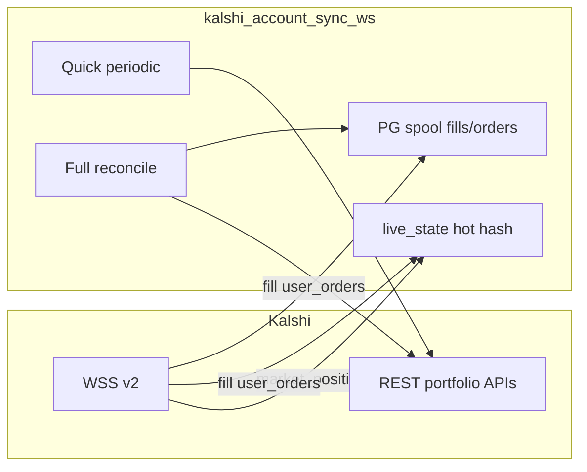

# Portfolio / account sync pipeline

This document describes [`backend/kalshi_account_sync_ws.py`](../backend/kalshi_account_sync_ws.py): Kalshi REST usage, WebSocket subscriptions, internal notifications, and environment knobs. Official Kalshi WebSocket contract: [WebSocket connection](https://docs.kalshi.com/websockets/websocket-connection).

## High-level flow

Portfolio **hot state** is **WebSocket-driven** for live upserts. **Startup baseline** seeds Redis from REST: current positions snapshot plus the prior **`LIVE_STATE_KALSHI_PORTFOLIO_RETENTION_HOURS`** (default 1h) of fills and orders via paginated `min_ts` polls. Ongoing: positions use WS upserts with periodic REST **prune only** (no REST upsert on the timer); fills/orders stay WS + spool.

## Hot path (live_state)

| Entity | Redis key | PG | WS action |
|--------|-----------|-----|-----------|
| Positions | `rec_io:live_state:v1:tenant:{slot}:kalshi:positions` | **None** (ephemeral) | REST baseline on startup; WS upserts live; REST timer prune only |
| Orders | `...:kalshi:orders` | Spooled upsert (history) | REST baseline (1h) on startup; WS upserts + spool live |
| Fills | `...:kalshi:fills` | Spooled upsert (history) | REST baseline (1h) on startup; WS upserts + spool live |

Pub/sub: `rec_io:live_state:updated` with kinds `kalshi_positions`, `kalshi_orders`, `kalshi_fills`.

Monitor: `/live-path-cache-monitor?source=kalshi_positions&user_no=0001` (also `kalshi_orders`, `kalshi_fills`).

Account manager **Open Positions** reads hot state via `GET /api/db/positions` (not PG). **Recent fills** use `GET /api/db/fills` from the hot fills hash (rolling window), not PG.

**Live tradeflow:** `trade_manager` `confirm_open_trade` / `confirm_close_trade` read order status, counts, and fee/cost fields from the **orders hot hash** only (`tradeflow_live_reads.kalshi_order` → `live_state_kalshi_portfolio.get_order`). PostgreSQL `orders_*` is historical spool only. Trade rows (`trades_*`) remain in PG.

Env: `LIVE_STATE_KALSHI_PORTFOLIO_RETENTION_HOURS` (default 1, fills/orders hot window), `PORTFOLIO_PG_SPOOL_FLUSH_MS` (default 250), `PORTFOLIO_PG_SPOOL_MAX_BATCH` (default 50), `ACCOUNT_SYNC_POSITIONS_PRUNE_SEC` (default 300), `ACCOUNT_SYNC_HOT_EXECUTOR_WORKERS` (default 4), `ACCOUNT_SYNC_REST_EXECUTOR_WORKERS` (default 1).

## REST inventory

| Function | HTTP | When it runs |
|----------|------|--------------|
| `sync_balance` | `GET /trade-api/v2/portfolio/balance` | Debounced balance; quick periodic; full reconcile; hourly/daily schedule; initial baseline |
| `sync_portfolio_hot_state_baseline` | positions + fills + orders REST | **Startup only** — positions snapshot; fills/orders paginated with `min_ts` = retention window |
| `sync_positions_prune_hot_state` | `GET .../portfolio/positions?limit=200` | Every `ACCOUNT_SYNC_POSITIONS_PRUNE_SEC` (default 300s); **prune only** (no hot upsert) |
| `sync_fills` | `GET .../portfolio/fills?limit=50` | Full reconcile; initial baseline (**PG only**, not hot hash) |
| `sync_orders` | `GET .../portfolio/orders?limit=50` | Full reconcile; initial baseline (**PG only**, not hot hash) |
| `sync_settlements` | `GET .../portfolio/settlements?limit=50` | Quick periodic; full reconcile; initial baseline |
| `sync_account_history` | v1 paged deposits + withdrawals | Inside `sync_balance` when Kalshi user id is available |

**Note:** `limit=50` on fills/orders/settlements means long-tail completeness depends on **full reconciliation** (`ACCOUNT_SYNC_FULL_RECONCILE_SEC`, default 900s) and periodic quick syncs.

## WebSocket

- **URL:** `wss://external-api-ws.kalshi.com/trade-api/ws/v2` (same host as docs; credentials via `KALSHI-ACCESS-*` headers on handshake).
- **Channels (single subscribe):** `market_positions`, `fill`, `user_orders` (see Kalshi subscribe command).
- **Behavior:** `market_position` → live_state positions hash (`position_cost_dollars`, `position_fp`, etc.); balance debounced. `fill` / `user_orders` → live_state hash + PG spool; balance debounced. PoC logging for first N fill/order messages.

## Timers

| Timer | Env | Default | Purpose |
|-------|-----|---------|---------|
| Debounce | `ACCOUNT_SYNC_DEBOUNCE_MS` | 400 | Coalesce rapid WS events before REST (fills/orders PG, balance) |
| Quick | `ACCOUNT_SYNC_QUICK_PERIODIC_SEC` | 300 | `sync_settlements` + `sync_balance` |
| Positions prune | `ACCOUNT_SYNC_POSITIONS_PRUNE_SEC` | 300 | REST positions poll → drop stale hot hash keys |
| Full | `ACCOUNT_SYNC_FULL_RECONCILE_SEC` | 900 | Fills/orders/settlements/balance REST (not hot hash) |

## Internal comms (after portfolio-plane Redis work)

| Target | Mechanism |
|--------|-----------|
| `main` db_change fanout | `publish_db_change_json` when `USE_TRADING_REDIS_COMMS`, else `POST /api/notify_db_change` |
| `monitor_manager` bankroll | `PUBLISH` `rec_io:mm:trade_events` (or `REDIS_CHANNEL_MONITOR_MANAGER`), else HTTP |
| `trade_manager` `positions_updated` | `PUBLISH` `rec_io:tm:positions_updated` (or `REDIS_CHANNEL_TM_POSITIONS_UPDATED`), else `POST /api/positions_updated` |

See also [TRADING_REDIS_COMMS.md](TRADING_REDIS_COMMS.md) and [REDIS_LEGACY_COMMS_AUDIT.md](REDIS_LEGACY_COMMS_AUDIT.md) section A3 / portfolio.
