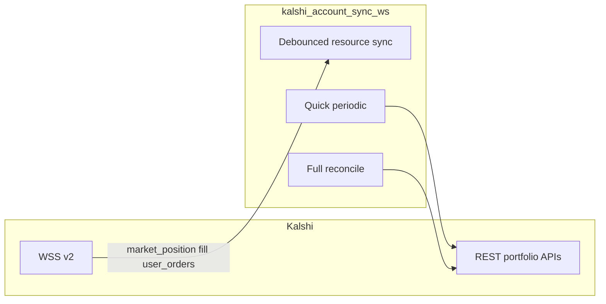

# Portfolio / account sync pipeline

This document describes [`backend/kalshi_account_sync_ws.py`](../backend/kalshi_account_sync_ws.py): Kalshi REST usage, WebSocket subscriptions, internal notifications, and environment knobs. Official Kalshi WebSocket contract: [WebSocket connection](https://docs.kalshi.com/websockets/websocket-connection).

## High-level flow

## REST inventory

| Function | HTTP | When it runs |
|----------|------|--------------|
| `sync_balance` | `GET /trade-api/v2/portfolio/balance` | After debounced position/fill/order work when needed; quick periodic; full reconcile; hourly/daily schedule; initial baseline |
| `sync_positions` | `GET .../portfolio/positions?limit=50` | Debounced `market_position` WS; full reconcile; initial baseline |
| `sync_fills` | `GET .../portfolio/fills?limit=50` | Debounced `fill` WS; full reconcile; initial baseline |
| `sync_orders` | `GET .../portfolio/orders?limit=50` | Debounced `user_orders` WS; full reconcile; initial baseline |
| `sync_settlements` | `GET .../portfolio/settlements?limit=50` | Quick periodic; full reconcile; initial baseline |
| `sync_account_history` | v1 paged deposits + withdrawals | Inside `sync_balance` when Kalshi user id is available |

**Note:** `limit=50` on positions/fills/orders/settlements means long-tail completeness depends on **full reconciliation** (`ACCOUNT_SYNC_FULL_RECONCILE_SEC`, default 900s) and periodic quick syncs.

## WebSocket

- **URL:** `wss://api.elections.kalshi.com/trade-api/ws/v2` (same host as docs; credentials via `KALSHI-ACCESS-*` headers on handshake).
- **Channels (single subscribe):** `market_positions`, `fill`, `user_orders` (see Kalshi subscribe command).
- **Behavior:** WS messages **trigger** debounced REST syncs; first N non-control messages for `fill` / `user_orders` are logged at INFO for PoC validation (compare to REST in logs).

## Timers

| Timer | Env | Default | Purpose |
|-------|-----|---------|---------|
| Debounce | `ACCOUNT_SYNC_DEBOUNCE_MS` | 400 | Coalesce rapid WS events before REST |
| Quick | `ACCOUNT_SYNC_QUICK_PERIODIC_SEC` | 300 | `sync_settlements` + `sync_balance` |
| Full | `ACCOUNT_SYNC_FULL_RECONCILE_SEC` | 900 | All five syncs (same as legacy 5-minute full cycle) |

## Internal comms (after portfolio-plane Redis work)

| Target | Mechanism |
|--------|-----------|
| `main` db_change fanout | `publish_db_change_json` when `USE_TRADING_REDIS_COMMS`, else `POST /api/notify_db_change` |
| `monitor_manager` bankroll | `PUBLISH` `rec_io:mm:trade_events` (or `REDIS_CHANNEL_MONITOR_MANAGER`), else HTTP |
| `trade_manager` `positions_updated` | `PUBLISH` `rec_io:tm:positions_updated` (or `REDIS_CHANNEL_TM_POSITIONS_UPDATED`), else `POST /api/positions_updated` |

See also [TRADING_REDIS_COMMS.md](TRADING_REDIS_COMMS.md) and [REDIS_LEGACY_COMMS_AUDIT.md](REDIS_LEGACY_COMMS_AUDIT.md) section A3 / portfolio.
